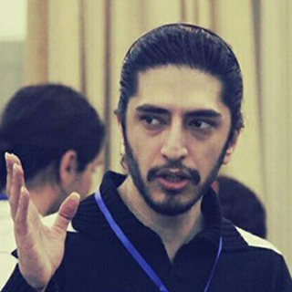
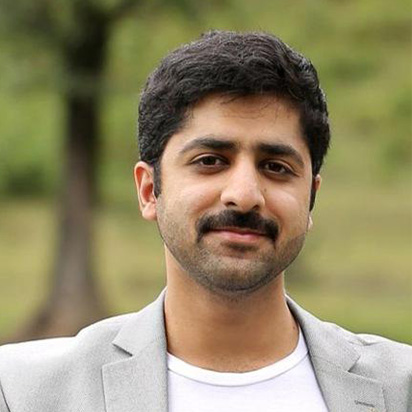

# About This Course

The course is a combination of applied and theoretical aspects of deep learning. In addition to discussing recent state-of-the-art models in both supervised and unsupervised learning, we delve into the details of various network architectures for processing texts and images. Special emphasis will be put on learning how to work with deep learning libraries, particularly Tensorflow 2.0. 

In this course you will learn the foundations of deep learning, understand various neural network architectures, and practice developing machine learning projects from scratch.

# Learning Objectives  

The course is a combination of applied and theoretical aspects of deep learning. In addition to discussing recent state-of-the-art models in both supervised and unsupervised learning, we delve into the details of various network architectures for processing texts and images. Special emphasis will be put on learning how to work with deep learning libraries, particularly Tensorflow 2.0. 

# Course Weekly Plan

Flipped style classroom: 
* Lecture (Sundays)
* TA Session (Tuesdays)
* Project Mentorship (Wednesdays)

   
 
            
  

   <h1>
    Course instructor
   </h1>
   

    
    
Mohammad Taher Pilehvar

   

  

  

   <h1>
    Teaching Assistants
   </h1>
   

    

     
     
Kiamehr Razaee

    

    

     
     
Mohsen Tabasi

    

 

   

   <h1>
    Mentors
   </h1>
   

    

     
     
Amir Mohammad Salehoof

    

    

     
     
Vahid Mazinani

    

 

